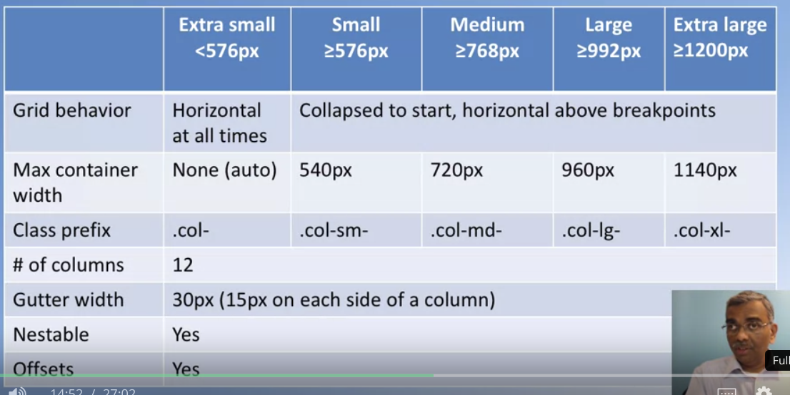

### Three Tier Architecture for Web development

- **Presentation Layer**
	Deals with everything that is UI related
	e.g. using JavaScript frameworks/libraries like Angular or React
	
- **Business Logic Layer**
	Contains the actual business logic (data validation, dynamic content processing)
	Server-side rendering (!)
	e.g. NodeJS and NodeJS modules
	
- **Data Access (Persistence) Layer**
	Interacts with the database (e.g. via an API)
	e.g. MongoDB
	
	

### What is Node.js?

JavaScript was originally designed as a scripting language for the browser. Node.js (a JavaScript runtime) although allows the execution of JavaScript code on the "desktop" (server side). To accomplish this, the Chrome V8 JavaScript engine has been ported from the browser to the desktop. 

Node.js is build around an event-driven, non-blocking I/O model which makes it easy to run asynchronous JavaScript on the desktop. 

### Node.js and NPM basics

Every package consists of ...

- **JS files**
- **package.json**
  - Serves as documentation for what packages your project depends on
  - Allows to specify the version of a package
  - Makes builds reproducible

**Create a new package.json:**    

- *npm init*

**Install a node package:** 

- *npm install \<package-name\>*

  **Note:**  
  *npm install* takes 3 exclusive, optional flags which save or update the package version in your main package.json:
   -S, --save: Package will appear in your dependencies.
   -D, --save-dev: Package will appear in your devDependencies.
   -O, --save-optional: Package will appear in your optionalDependencies.

### Responsive Design

Mainly motivated by ...

- Users are increasingly accessing websites from a variety of devices with different screen sizes
- One-size-fits-all approach is not possible

### Mobile-First Approach

We first think about mobile devices and how things should be rendered on such devices. Later on, we start to think about larger screens like, for instance, desktops.

### Bootstrap Grid System

- *viewport* - meta tag
	- Website will take the screen size into account and adapt the rendering of the page to the devices screen width
	- Website will be correctly rendered for the given screen size
	
- Screen size classes: *sm* for small, *md* for medium, *lg* for large, *xl* for extra large

- Every row in the Bootstrap grid system is divided into 12 columns (by default)

  Why 12?  Because it's a multiple of 2, 3, 4, 6 -> Means we are extremely flexible

- Layouts for different screen sizes can be defined by class *.col-\**, *.col-sm-\*,* etc.

- If we specify a style prefix for a container, the style is apply for devices with the given screen size and **above**

- *col-auto*: The number of columns occupied will be determined by its content

- **Vertical /Horizontal alignment:**    

  - *align-items-center*:  Content will be vertically centered in the row
  
  - *justify-content-center*:  Content will be horizontally center in the row (elements on the left/right won't be used)

  - Column offsets: *col-offset-sm-\** 
  
    
    
    

 

**Further resources:**

	https://getbootstrap.com/docs/4.0/layout/grid/ 
	http://blog.codeply.com/2016/04/06/how-the-bootstrap-grid-really-works/
 	https://blog.teamtreehouse.com/beginners-guide-to-responsive-web-design
 	https://scotch.io/tutorials/a-visual-guide-to-css3-flexbox-properties
 	https://css-tricks.com/snippets/css/a-guide-to-flexbox/

  

