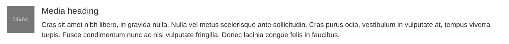
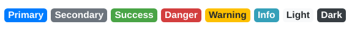
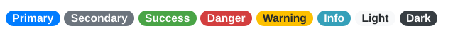
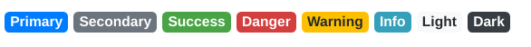
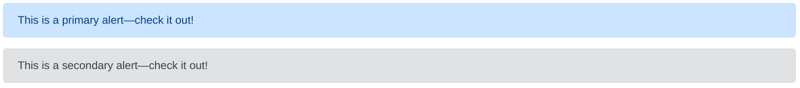
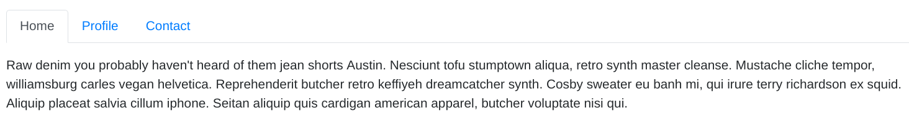
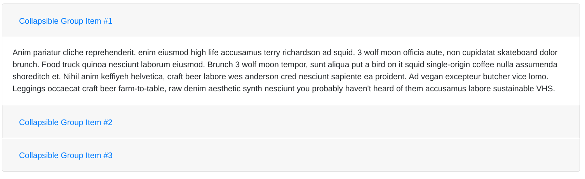

# Components


## Navigation and Navigation Bar

#### Defining Navigation bars

Navbars can be defined as follows:

```html
<nav class="navbar bg-primary navbar-dark navbar-expand-sm fixed-top">
	<div class="container">
		...
	</div>
</nav>
```
The container-element can be omitted. If we do not add the container-element, the navbar's content will appear at the top left corner (if no custom styling is applied).

##### Colored Navbars

We can easily can the color theme of our navbar by setting two parameters. The background color can be influenced by means of bg-color classes. In other words, we can choose from `bg-primary`, `bg-success`,  `bg-info`, `.bg-warning`, `bg-danger`, `bg-secondary`, `bg-dark` and `bg-light`.
The font color can be set using the attribute `navbar-dark` (white font color) or `navbar-light` (black font color).

##### Collapsing behavior

We can also control the collapsing behavior of the navigation bar `navbar-expand-{size}` tag. If we set `navbar-expand-sm`, the navbar will spread out vertically for small and extra small screens.

However, it's important to note that the navbar-expand option will NOT display a toggle-button for small screens automatically. It only controls the expansion behavior.

- `navbar-expand` = never collapses vertically (remains horizontal)
- `navbar-expand-sm` = collapses below sm widths <576px
- `navbar-expand-md` = collapses below md widths <768px
- `navbar-expand-lg` = collapses below lg widths <992px
- `navbar-expand-xl` = collapses below xl widths <1200px

##### Fixing the navbar at the top while scrolling

Can be done using the `fixed-top` attribute. It might be required to add additional padding to the websites content to prevent the navbar from overlapping the remaining content.


#### Adding content (logos, links, etc.) to the navigation bar

##### Adding a logo
Adding a logo is easy and can be done using the `navbar-brand` attribute.
```html
<nav class="navbar bg-primary navbar-dark navbar-expand-sm fixed-top">
	<div class="container">
		<a class="navbar-brand" href="#">Logo</a>
	</div>
</nav>
```
##### Adding a menu
A full-height and lightweight navigation (including support for dropdowns) can be added using the `navbar-nav` attribute. It's important to note that navigation in navbars will always occupy as much horizontal space as possible to keep its content securely aligned. Therefore, toggler classes need to be used for proper responsive styling.

Active states—with `active`—to indicate the current page can be applied directly to `nav-link`s or their immediate parent `nav-item`s.

```html
<nav class="navbar navbar-dark navbar-expand-sm bg-primary">
	<div class="container">
        <ul class="navbar-nav mr-auto">
            <li class="nav-item active"><a class="nav-link" href="#">Home</a></li>
        </ul>
	</div>
</nav>
```

##### Adjusting the menu position

The menu position can be influenced using the `mr-auto` (push items to the left) and `ml-auto` (push items to the right) attribute.

#### Adding a toggle button to collapse the navigation bar

Here's an example of a toggle-button added to the navigation bar. As we can see the button controls the visibility of the component with the id `Navbar`. This requires us to wrap the menu items in a component with the specified id.

```html
<nav class="navbar navbar-dark navbar-expand-sm bg-primary">
	<div class="container">
        <button class="navbar-toggler" type="button" data-toggle="collapse" 
         data-target="#Navbar"/>
        </ul>
	</div>
</nav>
```

```html
<div class="collapse navbar-collapse" id="Navbar">
	<ul class="navbar-nav mr-auto">
		<li class="nav-item active"><a class="nav-link" href="#">Home</a></li>
		<li class="nav-item"><a class="nav-link" href="./aboutus.html">About</a></li>
     	<li class="nav-item"><a class="nav-link" href="#">Menu</a></li>
   		<li class="nav-item"><a class="nav-link" href="#">Contact</a></li>
	</ul>
</div>
```


## Breadcrumbs

#### What are breadcrumbs?

Secondary navigation which is usually placed below the primary navigation and above the content.

It typically also indicates the current page's location within a navigational hierarchy.


#### Defining breadcrumbs

Breadcrumbs can be defined as follows:

```html
<ol class="breadcrumb">
	<li class="breadcrumb-item"><a href="#">Home</a></li>
    <li class="breadcrumb-item active">Library</li>
</ol>
```


## Icon Fonts

Icon Fonts provides a set of symbols and glyphs that can be used to style our website which can also be styled like regular fonts. Two well-known style package is called **Font Awesome** and **Bootstrap-Social**.

#### Import Font Awesome
Font Awesome can be imported by means of CSS stylesheets. After installing the `bootstrap-social`/ `font-awesome` package font via npm the corresponding stylesheets need to be imported as follows:

```html
<link rel="stylesheet" href="node_modules/font-awesome/css/font-awesome.min.css">
<link rel="stylesheet" href="node_modules/bootstrap-social/bootstrap-social.css">
```

#### Using font-awesome

Font-Awesome tags can be defined using the `fa` attribute(s). Sticking to the HTML standard, span-tags should be used to add icons. Nevertheless, in practice we will also encounter the usage of i (italic)-tags which is obviously wrong from a semantic point of view.  This is probably caused by the fact that the i-tag is shorter (less data have to be transmitted) and the "i" is often misinterpreted to stand for the term "icon". 

```html
<span class="fa fa-home fa-lg"></span>
<i class="fa fa-google-plus"></i>
```

##### Adjusting the icon size

The icon size can be adjusted using the following attributes:
- fa-lg
- fa-2x
- fa-3x
- fa-4x
- fa-5x

#### Using Bootstrap-Social buttons

Bootstrap-Social is typically used together with Font Awesome icons. It provides a simple way to add Font Awesome icons onto buttons.

```html
<a class="btn btn-social-icon btn-google" href="http://google.com/+">
	<i class="fa fa-google-plus"></i>
</a>
<a class="btn btn-social-icon btn-facebook" href="http://www.facebook.com/">
	<i class="fa fa-facebook"></i>
</a>
```


## Buttons and button groups

Button groups group buttons together on a single line.

#### Defining button groups

```html
<div class="btn-group" role="group">
	<a role="button" class="btn btn-primary" href="tel:+85212345678">
		<i class="fa fa-phone"></i> Call
	</a>
    <a role="button" class="btn btn-info">
    	<i class="fa fa-skype"></i> Skype
    </a>
</div>
```

Note that for assistive technologies (such as screen readers) to convey that a series of buttons is grouped, an appropriate `role` attribute needs to be provided. For button groups, this would be `role="group"`, while toolbars should have a `role="toolbar"`.

#### "button" vs "a" tag

Both type of tags can be used to define a bootstrap button. However, if the button should cause an action that can be triggered via an *href* tag, the a-tag is required. Otherwise, we can use the button-tag.

When using button classes on `<a>` elements that are used to trigger in-page functionality (like collapsing content), rather than linking to new pages or sections within the current page, these links should be given a `role="button"` to appropriately convey their purpose to assistive technologies such as screen readers.


## Forms

Bootstrap provides three different types of form layouts:

- Vertical Form (default form layout)
- Horizontal Form
- Inline Form

#### Alignment

##### Vertical forms

Elements are aligned vertically by default. Therefore no additional attribute needs to be added to the `form-group` class.

```html
<form>
	<div class="form-group">
        <label for="inputEmail">Email</label>
        <input type="email" class="form-control" id="inputEmail" placeholder="Email">
    </div>
    <div class="form-group">
		<label for="inputPassword">Password</label>
        <input type="password" class="form-control" id="inputPassword" placeholder="Password">
    </div>
</form>
```

##### Horizontal forms

Horizontal alignment can be achieved using Bootstrap grid classes. We just need to add the `row` class to the `form-group` and position the elements inside using `col` classes. 

```html
<form>
    <div class="form-group row">
        <label for="inputEmail" class="col-sm-2 col-form-label">Email</label>
        <div class="col-sm-10">
            <input type="email" class="form-control" id="inputEmail" placeholder="Email">
        </div>
    </div>
</form>
```

##### Inline forms

Used if we want to display a series of labels, form controls and buttons on a single horizontal row to compact the layout. This can be achieved by adding the `form-inline` class to the `form-group` element.

```html
<form class="form-inline">
    <div class="form-group mr-2">
        <label class="sr-only" for="inputEmail">Email</label>
        <input type="email" class="form-control" id="inputEmail" placeholder="Email">
    </div>
</form>
```

#### Form controls

Textual form controls—like `<input>`s, `<select>`s, and `<textarea>`s—are styled with the `.form-control` class. Included are styles for general appearance, focus state, sizing, and more.

At this point we need to keep the different <a href="https://www.w3schools.com/html/html_form_input_types.asp">types of input elements </a>in our mind to ensure the correct type of input validation.

```html
<form>
	<div class="form-group row">
		<label for="firstname" class="col-md-2 col-form-label">First Name</label>
		<div class="col-md-10">
			<input type="text" class="form-control" id="firstname" name="firstname" placeholder="First Name">
		</div>
	</div>
 	<div class="form-group row">
        <div class="offset-md-2 col-md-10">
			<button type="submit" class="btn btn-primary">Send Feedback</button>
		</div>
	</div>
</form>
```

##### Difference between the name and the id attribute

IDs are for hooking the element with JavaScript and CSS. The name attribute, however, is used in the HTTP request sent by your browser to the server as a variable name associated with the data contained in the value attribute.


## Tables

Tables in Bootstrap can be defined by assigning the base class `.table` to any `<table>` tag. 

```html
<table class="table table-striped">
	<thead class="thead-dark">
		<tr>
			<th>&nbsp;</th>
			<th>2013</th>
    	</tr>
	</thead>
	<tbody>
		<tr>
        	<th>Employees</th>
 			<td>15</td>
		</tr>
    </tbody>
</table>
```

However, the table will not be responsive by default. To make it responsive we need to wrap the table in a `.table-responsive{-sm|-md|-lg|-xl}` block. This will allow tables to be scrolled horizontally with ease.

```html
<div class="table-responsive">
  <table class="table">
    ...
  </table>
</div>
```


## Cards

A **card** is a flexible and extensible content container. It includes options for headers and footers, a wide variety of content, contextual background colors, and powerful display options. Cards can be defined with the class attribute `card`.

```html
<div class="card">
	<h3 class="card-header bg-primary text-white">Facts At a Glance</h3>
   	<div class="card-body">
	<dl class="row">
		<dt class="col-6">Started</dt>
  		<dd class="col-6">3 Feb. 2013</dd>
		<dt class="col-6">Major Stake Holder</dt>
	</dl>
</div>
```


#### Content types

Cards support a wide variety of content, including images, text, list groups, links, and more.  Below are examples of what’s supported.

- `card-body`

  The main building block of a card. Use  whenever a padded section within a card is required.

- `card-title`

  Card titles are used by adding `.card-title` to a `<h*>` tag. The element is placed **within** the `card-body` element

- `card-subtitle`

- `card-img-top`

  Places an image to the top of the card. The element is defined outside of the `card-body` block. We can also add text to the card using `card-text`

- ...      https://getbootstrap.com/docs/4.0/components/card/


## Images

Images can be made responsive (so they never become larger than their parent elements) with the `img-fluid` attribute. Alignment of images can be achieved with float helper classes or text alignment classes.

```html
<div class="col-12 col-sm text-center align-self-center">
	
</div>
```


## Media Objects

The [media object](http://www.stubbornella.org/content/2010/06/25/the-media-object-saves-hundreds-of-lines-of-code/) helps build complex and repetitive components where some media is positioned alongside content that doesn’t wrap around said media.

Below is an example of a single media object. Only two classes are required—the wrapping `.media` and the `.media-body` around your content. Optional padding and margin can be controlled through [spacing utilities](https://getbootstrap.com/docs/4.0/utilities/spacing/).

```html
<div class="media">
  
  <div class="media-body">
    <h5 class="mt-0">Media heading</h5>
    Cras sit amet nibh libero
  </div>
</div>
```




## Badges

Badges can be used to display text more prominently on a website.

```html
<span class="badge badge-primary">Primary</span>
<span class="badge badge-secondary">Secondary</span>
<span class="badge badge-success">Success</span>
<span class="badge badge-danger">Danger</span>
<span class="badge badge-warning">Warning</span>
<span class="badge badge-info">Info</span>
<span class="badge badge-light">Light</span>
<span class="badge badge-dark">Dark</span>
```



```html
<span class="badge badge-pill badge-primary">Primary</span>
<span class="badge badge-pill badge-secondary">Secondary</span>
<span class="badge badge-pill badge-success">Success</span>
<span class="badge badge-pill badge-danger">Danger</span>
<span class="badge badge-pill badge-warning">Warning</span>
<span class="badge badge-pill badge-info">Info</span>
<span class="badge badge-pill badge-light">Light</span>
<span class="badge badge-pill badge-dark">Dark</span>
```



```html
<a href="#" class="badge badge-primary">Primary</a>
<a href="#" class="badge badge-secondary">Secondary</a>
<a href="#" class="badge badge-success">Success</a>
<a href="#" class="badge badge-danger">Danger</a>
<a href="#" class="badge badge-warning">Warning</a>
<a href="#" class="badge badge-info">Info</a>
<a href="#" class="badge badge-light">Light</a>
<a href="#" class="badge badge-dark">Dark</a>
```




## Alerts

Alerts provide contextual feedback messages for typical user actions with the handful of available and flexible alert messages.

```html
<div class="alert alert-primary" role="alert">
  This is a primary alert—check it out!
</div>
<div class="alert alert-secondary" role="alert">
  This is a secondary alert—check it out!
</div>
```




## Progress

Can be used to show progress bars. Progress components are built with two HTML elements, some CSS to set the width, and a few attributes. We don't use the HTML5 progress-element.

```html
<div class="progress">
  <div class="progress-bar" role="progressbar" style="width: 25%" aria-valuenow="25" aria-valuemin="0" aria-valuemax="100"></div>
</div>
```


## Tabs

Tabs can be implemented by taking a basic nav and adding the `nav-tabs` attribute.

```html
<ul class="nav nav-tabs" id="myTab" role="tablist">
  <li class="nav-item">
    <a class="nav-link active" id="home-tab" data-toggle="tab" href="#home" role="tab" aria-controls="home" aria-selected="true">Home</a>
  </li>
  <li class="nav-item">
    <a class="nav-link" id="profile-tab" data-toggle="tab" href="#profile" role="tab" aria-controls="profile" aria-selected="false">Profile</a>
  </li>
  <li class="nav-item">
    <a class="nav-link" id="contact-tab" data-toggle="tab" href="#contact" role="tab" aria-controls="contact" aria-selected="false">Contact</a>
  </li>
</ul>
<div class="tab-content" id="myTabContent">
  <div class="tab-pane fade show active" id="home" role="tabpanel" aria-labelledby="home-tab">...</div>
  <div class="tab-pane fade" id="profile" role="tabpanel" aria-labelledby="profile-tab">...</div>
  <div class="tab-pane fade" id="contact" role="tabpanel" aria-labelledby="contact-tab">...</div>
</div>
```




## Collapse

The collapse JavaScript plugin can be used to show or hide content on a website.

Links can be used with the `href` attribute, or a button with the `data-target` attribute. In both cases, the `data-toggle="collapse"` is required.

```html
  <a class="btn btn-primary" data-toggle="collapse" href="#collapseExample" role="button" aria-expanded="false" aria-controls="collapseExample">
    Link with href
  </a>
  <button class="btn btn-primary" type="button" data-toggle="collapse" data-target="#collapseExample" aria-expanded="false" aria-controls="collapseExample">
    Button with data-target
  </button>
</p>
<div class="collapse" id="collapseExample">
  <div class="card card-body">
    Anim pariatur cliche reprehenderit, enim eiusmod high life accusamus terry richardson ad squid. Nihil anim keffiyeh helvetica, craft beer labore wes anderson cred nesciunt sapiente ea proident.
  </div>
</div>
```


## Accordion

Using the card-component, the default collapse behavior can be used to create an accordion.

```html
<div class="accordion" id="accordionExample">
  <div class="card">
    <div class="card-header" id="headingOne">
      <h2 class="mb-0">
        <button class="btn btn-link" type="button" data-toggle="collapse" data-target="#collapseOne" aria-expanded="true" aria-controls="collapseOne">
          Collapsible Group Item #1
        </button>
      </h2>
    </div>

    <div id="collapseOne" class="collapse show" aria-labelledby="headingOne" data-parent="#accordionExample">
      <div class="card-body">
        Anim pariatur cliche reprehenderit, enim eiusmod high life accusamus ...
```




## Tooltips

To make use of tooltips we first need to add the following snippet to our webpage. This will initialize all tooltips by their data-toggle attribute.

```html
$(function () {
  $('[data-toggle="tooltip"]').tooltip()
})
```

A tooltip can then be added to buttons by specifying its position, title and data-toggle attribute.

```html
<a role="button" href="#reservation" type="button" data-toggle="tooltip" data-placement="bottom" title="Or Call us at <br><strong>+852 12345678</strong>" data-html="true" class="btn btn-block nav-link btn-warning">Reserve table</a>

<button type="button" class="btn btn-secondary" data-toggle="tooltip" data-placement="top" title="Tooltip on top">Tooltip on top</button>
```

 **Note:** `data-html` needs to be added if the title includes html-tags.


## Modals

We can add dialogs to a website by means of the Bootstraps JavaScript modal plugin. Modals are always positioned over everything else in the document and remove scroll from the `<body>` so that modal content scrolls instead.

Below we can see a static modal example.

```html
<div class="modal" tabindex="-1" role="dialog">
  <div class="modal-dialog" role="document">
    <div class="modal-content">
      <div class="modal-header">
        <h5 class="modal-title">Modal title</h5>
        <button type="button" class="close" data-dismiss="modal" aria-label="Close">
          <span aria-hidden="true">&times;</span>
        </button>
      </div>
      <div class="modal-body">
        <p>Modal body text goes here.</p>
      </div>
      <div class="modal-footer">
        <button type="button" class="btn btn-primary">Save changes</button>
        <button type="button" class="btn btn-secondary" data-dismiss="modal">Close</button>
      </div>
    </div>
  </div>
</div>
```

### Activating a modal

A modal can be activated by means of the `data-toggle` controller element along with a `data-target`.

```html
<button type="button" data-toggle="modal" data-target="#myModal">Launch modal</button>
```


## Carousel

A carousel is a slideshow component that allows cycling through elements.

**Note:** Carousels don’t automatically normalize slide dimensions. As such, you may need to use additional utilities or custom styles to appropriately size content.

##### Slideshow with indicator, controls and captions

```html
<div id="carouselExampleSlidesOnly" class="carousel slide" data-ride="carousel">
  <div class="carousel-inner">
    <div class="carousel-item active">
      
      <div class="carousel-caption d-none d-md-block">
    	<h5>...</h5>
    	<p>...</p>
      </div>
  </div>
    </div>
    <div class="carousel-item">
      
      <div class="carousel-caption d-none d-md-block">
    	<h5>...</h5>
    	<p>...</p>
      </div>
    </div>
  </div>
  <a class="carousel-control-prev" href="#carouselExampleControls" role="button" data-slide="prev">
  	<span class="carousel-control-prev-icon" aria-hidden="true"></span>
    <span class="sr-only">Previous</span>
  </a>
  <a class="carousel-control-next" href="#carouselExampleControls" role="button" data-slide="next">
    <span class="carousel-control-next-icon" aria-hidden="true"></span>
    <span class="sr-only">Next</span>
  </a>
  <ol class="carousel-indicators">
    <li data-target="#indicator1" data-slide-to="0" class="active"></li>
    <li data-target="#indicator2" data-slide-to="1"></li>
  </ol>
  <button class="btn btn-danger btn-sm" id="carouselButton">
     <span id="carousel-button-icon" class="fa fa-pause"></span>
   </button>
</div>

```

##### Animating and controlling the slideshow

The following snippet shows how to animate and add a control button to the slideshow.

**Add the control button to the carousel:**

```html
<div id="carouselExampleSlidesOnly" class="carousel slide" data-ride="carousel">
  ...
  <button class="btn btn-danger btn-sm" id="carouselButton">
     <span id="carousel-button-icon" class="fa fa-pause"></span>
   </button>
</div>
```

**Initialize the animation and implement the control button's control logic:**

```html
....
  <script>
    $(document).ready(function() {
      $("#mycarousel").carousel({
        interval: 2000
      });
      $("#carouselButton").click(function() {
        if ($("#carouselButton").children('span').hasClass('fa-pause')) {
          $("#mycarousel").carousel('pause');
          $("#carouselButton").children('span').removeClass('fa-pause');
          $("#carouselButton").children('span').addClass('fa-play');
        } else {
          $("#mycarousel").carousel('cycle');
          $("#carouselButton").children('span').removeClass('fa-play');
          $("#carouselButton").children('span').addClass('fa-pause');
        }
      });
    });
  </script>

</body>
```

